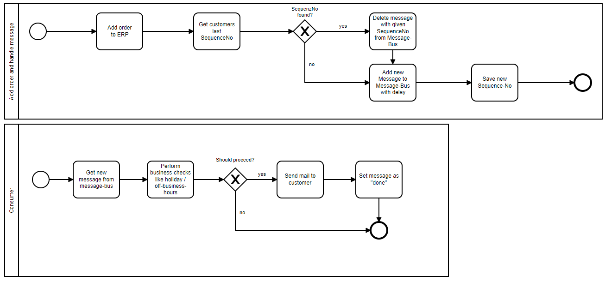

# Comments on suggested solution

## Advantages
- simple and clean approach
- rapid development
- just one "component" to maintain

## Disadvantes
- database load may increase
    - regular queries (every minute)
    - depending on archiving or partition strategy the data being processed will rise over time
    - Select query can harm other db operations and affect write operations/slow down system
    - DB will be queried, even if no orders were made in the particular time-range
- Can multiple script instances start every minute? Overlapping possible?
    - Email generation and send-out can take longer than a minute
    - If script can only run once, next minute run will be delayed
    - Scalinng possibilities 
- Error handling: what if cron failes - how to resend

# Alternative solution

## [1] Read-Only database
This approach is related to the CQRS (Command Query Responsibility Segregation)pattern.
Main idea is to add a ready only copy of the database (maybe based on transaction-log shipping) to the setup and let the cron-task query the read-only database.

This would not harm the database performance of the "production"/command database.
Addaption would not be a big impact, because most DBMS have this feature build-in and setup is mostly done quickly for the DB administrator.

Downside would be the possible replication delay (depending on write operations and scope of replication) and the additional hardware-resources for the read-only copy - DB administration afford as well.

## [2] Message bus - delayed processing
In this example I assume that we are using Azure Service Bus as messaging bus.

This product has a feature to delay the message processing - so the actual date, when a message is added to the bus and available for subscribers can be defined.
And of course the message can be deleted before execution.
Docs are here: https://docs.microsoft.com/en-us/azure/service-bus-messaging/message-sequencing#scheduled-messages

Idea would look like this:
- When? 
    - After order has been added e.g. to ERP
    - OR if message bus is already in place - could be done in parallel, just process the order message with another consumer (needs to be checked)
- What? 
    - Check for last customer order or db-table to cancel an already existing message in this topic (we save the new sequence number later)
    - Send a message with the property "ScheduledEnqueueTimeUtc" now + 3w to a special topic for that
    - Save SequenceNumber of this message 
    (on order level or in some db-table - depends on system capabilities)
    - Create one or more subscription/consumer to take care of message processing. Similar to the cronjob 
- Why?
    - a bit more load on order-adding (needs to be rated finally)
    - additonal details are only read by consumer-service if a message is there
    - no unnecessary reads e.g. at off-business hours
    - Service-Bus is quickly setuped and uses less resources

### Small BPMN diagram

Made with [BPMN.io](https://demo.bpmn.io/new)

**Hint/Addition**: I could also imagine a solution without message-bus e.g. with a job-processing service like [Hangfire](https://www.hangfire.io/) - the pattern would be more or less equal.

